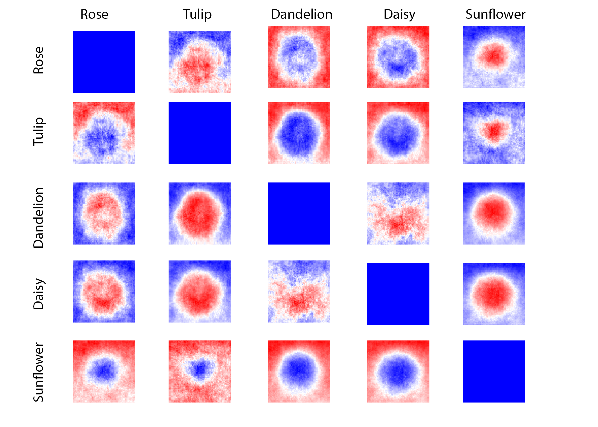

## Approximately 67% of households have pets in the United States, yet toxicity levels of common flowers are not readily available. 

Pet-Lab will:
- Identify between 5 flower types depending on unique charasteristics.
- Search database to provide user with toxicity information (severity, common symptoms) as well as flower description to aide in detection confirmation.

## Existing products and gap in the Market

| APCC by the ASPCA does have information about the toxicity of plants and flowers but lacks identification capabilities.   |

## How to tell different flowers apart?

### A simplified model:
We look for "features" or ways in which we can tell two different flowers apart using their pixel values

Below we have an average of the pixel values at each position of all the images for each flower (left), we can then use that to get the contrast between the average pixel values for each flower type (right), both of these can be used as features to tell the flowers apart.  

      
      
 

  
  

### How Pet-Lab tells flowers apart:

Pet-Lab uploads a trained model for image classification, the following was done when training the model.

- removes the background of all images used for training
- re-scales all pixels to contain values from 0 to 1
- Uses Inception v3  architecture pretrained on Imagenet

