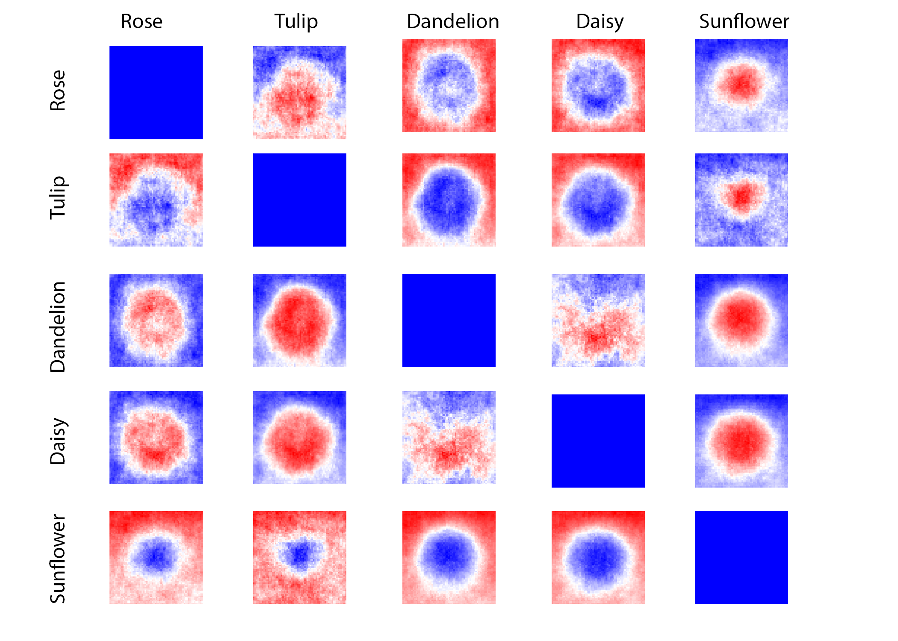
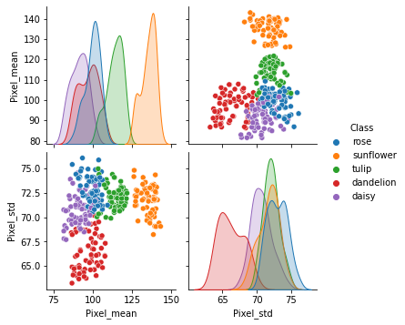
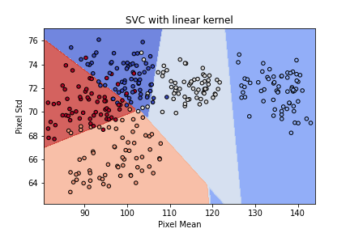

## Approximately 67% of households have pets in the United States, yet toxicity levels of common flowers are not readily available. 

Pet-Lab will:
- Identify the flower type depending on unique charasteristics.
- Search database to provide user with toxicity information (severity, common symptoms) as well as flower description to aide in detection confirmation.

## Existing products and gap in the Market

|         |
| -------------- |
| APCC by the ASPCA does have information about the toxicity of plants and flowers but lacks identification capabilities.   |

**Some of the most common complaints about APCC are as follows:**
- Poor pictures of plants/ dont know what plants I have are called
- Listings by common not latin names
- Doesnt say how much would be toxic
- The contact number to poison control charges a fee.
- Small amount of plants and hasn't been updated since 2015.
- Doesn/t have flowers commonly used in essential oils.
- “Much to exact. Recognizes almond but not almonds. Does not recognize anything    with a trailing space.
- Weeds,  You have plants but nothing about weeds which dogs are more likely to eat.

## Target Goals

## Explaratory Data Analysis

### Average images, Contrast of Images and PCA of the 5 most common classes (rose, dandelion, daisy, tulip, sunflower)

      
 

  
   
  

### Getting features of the 5 most common classes

  

 

#### Fitting and making predictions

      

kNN(k=3) accuracy is : 0.87

NB accuracy: 0.91

dtree accuracy: 0.91

Random Forrest accuracy: 0.91

