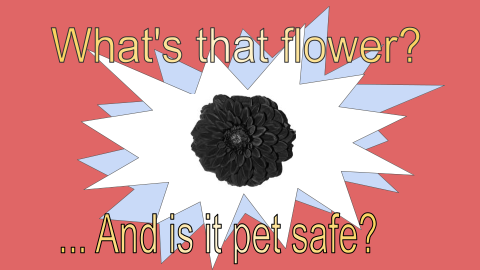

### Approximately 67% of households have pets in the United States, yet toxicity levels of common flowers are not readily available. 

Pet-Lab will:
- Use a nueral network to identify the flower.
- Search database to provide user with toxicity information (severity, common symptoms) as well as flower description to aide in detection confirmation.

```markdown
Syntax highlighted code block

# Clear purpose - meaningful impact
## How unique/different: what benefits does it offer?
<$\gamma$>

while other apps exist on the market that identify flowers, they dont have any information abiout animal toxicity.

- There exist one app made by the ASPCA, however it cannot identify flowers from pictures and doesnt contain sufficient records.  Some of the most comon complaints from the targeted demographic are as follows:
- Wanted common names more visible
- No recommendations for things to do at home for mild issues
- Doesnt say how much would be toxic
- Dont like that the contact poison control charges you
- Small amount of plants 
- Hasnt been update
- Doesnt have Common flowers turned(used in)  to oil
- Poor pictures of plants/ dont know what plants are called
- “Much to exact. Recognizes almond but not almonds. Does not recognize anything    with a trailing space.
- Weeds,  You have plants but nothing about weeds which dogs are more likely to eat.

### Header 3

- Bulleted
- List

1. Numbered
2. List

**Bold** and _Italic_ and `Code` text

[Link](url) and 
```

For more details see [GitHub Flavored Markdown](https://guides.github.com/features/mastering-markdown/).

### Goals and check points


### Support or Contact

Having trouble with Pages? Check out our [documentation](https://docs.github.com/categories/github-pages-basics/) or [contact support](https://support.github.com/contact) and we’ll help you sort it out.
