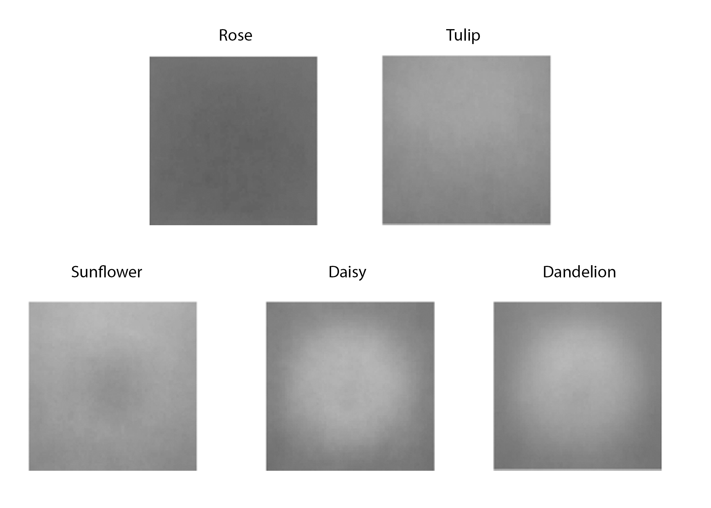
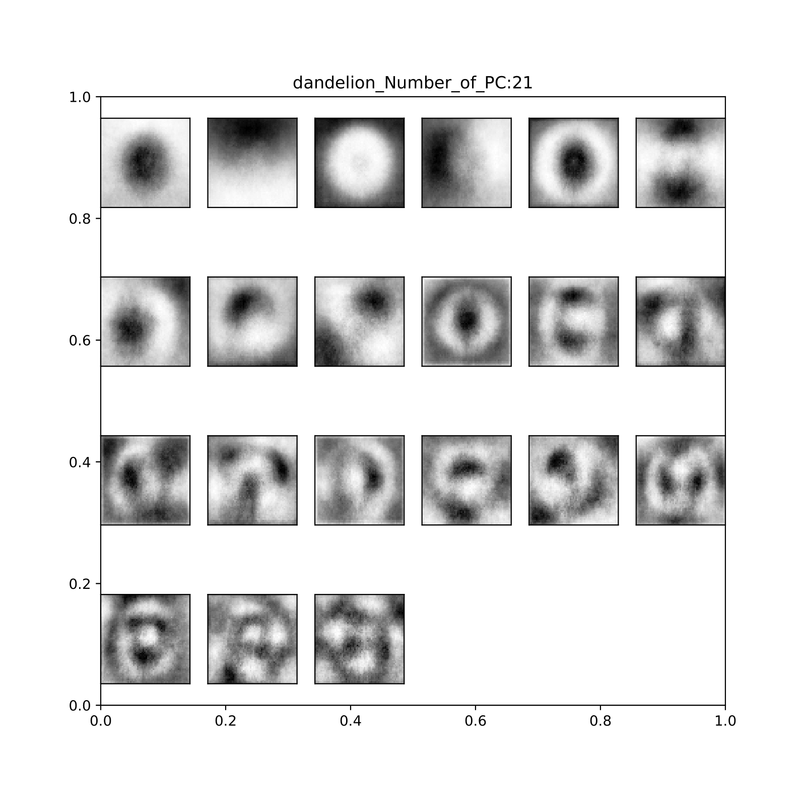

---
---

@import "";
 

  
  

## Approximately 67% of households have pets in the United States, yet toxicity levels of common flowers are not readily available. 

Pet-Lab will:
- Identify the flower type depending on unique charasteristics.
- Search database to provide user with toxicity information (severity, common symptoms) as well as flower description to aide in detection confirmation.

## Existing products and gap in the Market

| APCC by the ASPCA does have information about the toxicity of plants and flowers but lacks identification capabilities.   |

## How to tell plants and flowers apart?

### Average images, Contrast of Images and PCA of the 5 most common classes (rose, dandelion, daisy, tulip, sunflower)

      
 

  
  

#### Fitting and making predictions

# Current and Future Developments

<form action="https://share.streamlit.io/flrivera/pet-lab/main/Recog_app.py">
    <input type="submit" value="Go to Streamlit App" />
</form>

